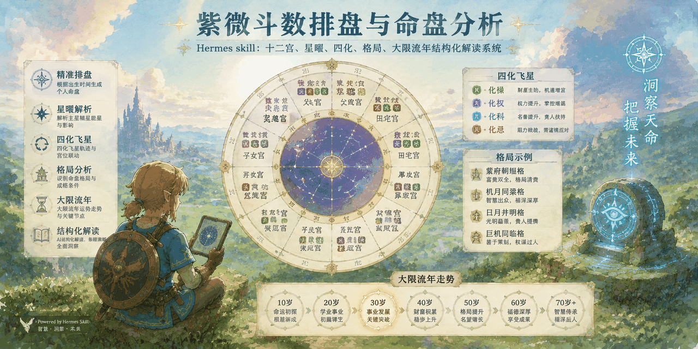

<div align="center">



</div>

# 紫微斗数 AI 解盘技能 (Zi Wei Dou Shu Chart Reading Skill)

[](LICENSE)

紫微斗数 AI Skill — 一份面向 LLM（Claude、DeepSeek、GPT 等）的结构化解盘指令集。**不是排盘工具，是解盘引擎。**

## 与常见紫微斗数项目的区别

大多数紫微斗数项目做的是「排盘」——把生日变成星盘。这只需要一个文件即可运行
本项目做的是「解盘」:标准化Json星盘已经有了，问题是怎么让 AI 读出水准。

核心思路：**把人类命理师的解盘逻辑，写成 AI 能严格执行的工作流。**

## 架构设计

```
ziwei-doushu/
├── SKILL.md                ← 核心：流程指令 + 决策路由 + 输出模板
├── README.md               ← 本文件
└── references/             ← 权威数据层（AI 按需读取，不内联）
    ├── shier-gong.md           十二宫位详解（含空宫、夹宫处理规则）
    ├── shisi-zhuixing.md       十四主星详解（五行、亮度、庙旺陷落）
    ├── fuzhu-xing.md           辅星助星详解
    ├── sha-xing.md             煞星详解
    ├── sihua.md                四化飞星（含天干四化表、飞化分析方法）
    ├── geju.md                 格局分析（吉格/凶格/条件/纯度）
    ├── daxian-liunian.md       大限流年推算（含身宫）
    ├── hunyin.md               婚姻感情专题
    ├── shiye-caifu.md          事业财富专题
    ├── jiankang.md             健康专题
    ├── heluo-guaxiang.md       河洛卦象分析
    ├── qintian-sihua.md        欽天四化分析
    ├── wuxing-shengke.md       五行生克分析
    └── xingqing-mingli.md      星情论与名人命例
```

排盘请使用成熟的第三方工具（见下方「排盘」小节），本项目不包含排盘功能。

## 核心机制

### HARD-GATE 规则

SKILL.md 本身只有流程指令。所有星曜属性、宫位含义、格局条件、四化规则等具体数据，**全部放在 references/ 目录中**，AI 每次回答前必须按需读取。

```
每次回答用户前，必须先读取与问题相关的所有 reference 文件。不读不答。
```

这是为了防止 AI 凭训练数据「编造」紫微斗数内容而设计的安全带。

### 决策路由

用户问题进入后，按 14 条路径自动路由到对应的 reference 文件：

```
用户请求
├─ 宫位/三方四正/空宫 → references/shier-gong.md
├─ 主星特性/庙旺陷落  → references/shisi-zhuixing.md
├─ 四化/来因宫        → references/sihua.md
├─ 格局评定            → references/geju.md
├─ 大限/流年/身宫     → references/daxian-liunian.md
├─ 婚姻               → references/hunyin.md
├─ 事业/财运          → references/shiye-caifu.md
├─ 健康               → references/jiankang.md
├─ 五行生克           → references/wuxing-shengke.md
└─ 跨领域             → 多文件组合读取
```

### 双输出模式

| 模式 | 适用场景 | 输出结构 |
|------|----------|----------|
| Short Mode | 具体 yes/no 问题、单一事件预测 | 结论 → 关键宫位 → 时间推算(可选) → 建议 |
| Full Mode | 整体格局分析、全面解盘 | 命盘概览 → 格局评定 → 三方四正 → 专题分析 → 时间推算 |

### 五步解盘工作流

1. **命宫三方四正分析** — 三合派核心，空宫借对规则
2. **星曜综合互动** — 主星+辅星+煞星+四化+五行生克+夹宫效应
3. **格局三層评定** — 类型/等级/纯度，含星格+数格九品体系
4. **时间推算** — 生年四化 → 大限 → 流年 → 身宫
5. **聚焦问题分析** — 三合派 70% + 辅助流派最高 30%

### 流派权重

| 流派 | 权重 | 角色 |
|------|------|------|
| 三合派 | 70% | 核心框架 |
| 飞星四化 | 15% | 宫位互动验证 |
| 河洛卦象 | 10% | 先后天卦象补充 |
| 欽天四化 | 5% | 来因宫定位 |

辅助流派总和不超过 30%。数据不足时跳过，不编造。

### 防绕过机制

内建 7 条 Red Flag 检查 — 当 AI 试图「凭记忆回答」「跳过简单问题」「偷懒不读 reference」时，规则强制拉回。

## 使用方式

### 安装为 AI Skill

**Hermes Agent**：

将本仓库克隆到 `~/.hermes/skills/ziwei-doushu/`，对话时输入 `ziwei-doushu` 即可触发。

**Claude Code / Claude.ai**：

```bash
# 安装为 Claude Code skill
git clone https://github.com/SuperGODOG/ziwei-doushu.git ~/.claude/skills/ziwei-doushu
```

对话时输入「紫微斗数」即可触发。也可直接将 `SKILL.md` 内容粘贴为 Claude 对话的 system prompt，并上传 `references/` 目录作为知识库附件。

**其他 AI 工具**：

将 `SKILL.md` + `references/` 目录作为 system prompt 或 skill 文件导入，具体方式取决于平台。

### 排盘

本技能目前只做解盘，不做排盘。


**为什么不自带排盘？** 紫微斗数排盘涉及农历/闰月转换、五虎遁、五行局对照、紫微/天府星系分布、六吉/六煞/四化定位等大量精细规则，任何简化实现都容易出错。将排盘外包给专门维护的工具，AI 专注解盘，这是本项目的定位。
你问我为什么?本来就一个工具能解决的事
当然是我偷懒了,
当然还有个细节问题:LLM很多时候会根据你的年龄段大多数的人的境遇来猜(所以就算我做排盘也没办法消除你输入的出生日期,除非我把排盘后的Json去除年龄,传参给subAgent,推理全权交给它们.但这会丧失很多细节)
所以请使用成熟的第三方排盘工具，将排出的星盘按 SKILL.md「用户引导」小节的格式贴给 AI 即可。尽量不要暴露具体年月日数据.
后期找到合适方案会加入到skill

推荐排盘工具：

- **[iztro](https://github.com/SylarLong/iztro)** — 开源紫微斗数排盘 JS 库（含 TypeScript 类型定义，浏览器/Node 皆可用），另有 Python 移植版 `iztro-py`
- **任意在线排盘网站** — 搜索「紫微斗数 在线排盘」，选择支持导出十二宫星曜、生年四化、当前大限的即可


## 触发词

紫微斗數、紫微、斗數、命盤、排盤、星盤、十二宮、命宮、四化、大限、流年、ziwei、purple star、astrolabe

## 与上游项目的关系

本项目基于 [Wolke/ziwei-doushu](https://github.com/Wolke/ziwei-doushu) 进行重构。主要变更：

- 定位从「排盘+解盘」改为「纯解盘引擎」
- 新增 HARD-GATE 防编造机制
- 新增决策路由树（14 条路径）
- 新增 Short/Full 双输出模式
- 新增五步解盘工作流
- 新增流派权重分配体系
- SKILL.md 从 80 行扩至 360+ 行
- references 从 10 个扩充至 14 个

## 路线图

目前项目是一个 AI Skill 指令集，需要依赖Harness比如Codex / Claude Code / Hermes Agent /Antigravity CLI 等平台运行。后续计划：

### Phase 1：独立化（就近）

- [ ] 封装 Harness 层：将 SKILL.md + references 打包为可独立调用的解盘引擎
- [ ] 接入 LLM API（DeepSeek / 千问），去掉对特定 Agent 平台的依赖
- [ ] 输出标准化：命盘 JSON → 解盘引擎 → 结构化解读文本 / JSON

### Phase 2：可用产品（中期）

- [ ] Next.js 前端：用户输入生日 → 自动排盘 → AI 解读 → 流式展示
- [ ] 多流派切换：用户可选择三合派为主 / 飞星派为主 / 全流派综合
- [ ] ICP 备案，国内可访问

### Phase 3：差异化竞争（远期）

- [ ] 名人命盘对比：用户命盘 vs 历史名人命盘相似度分析
- [ ] 多流派交叉验证：同一问题从三合/飞星/河洛/欽天四角度解读
- [ ] 解读质量评估：基于 reference 的一致性和完整性自动评分

> 路线图是方向，不是承诺。PR welcome。

## 许可

CC BY-NC-SA 4.0

---

*命由天造，运由己生。虽曰天命,岂非人事?紫微斗数是认识自己的工具，是合理化决策的玄学担保机制,而非宿命的判决书。*
